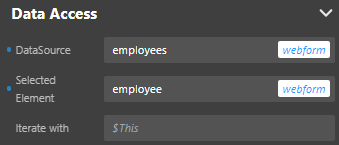
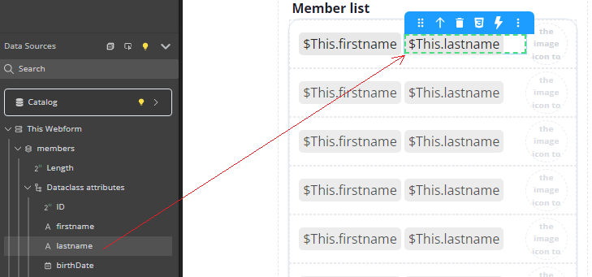
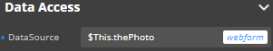
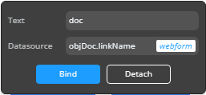
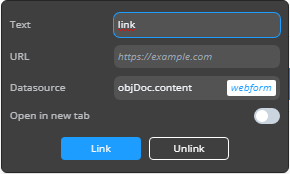
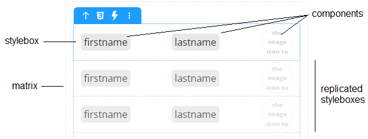
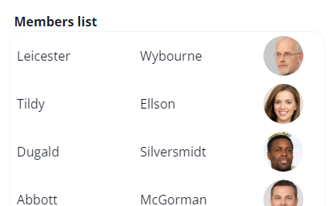
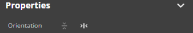

Components are the building blocks of your application. 

## Managing components

### Adding components

The Component library lets you search for a component or choose one from the list. 

To add a component, drag it from the Components library section and drop it on the canvas.

Once a component is on the canvas, you can [customize its look](styling.md) and bind a data source to it (if possible).

### Tooltip

When you select a component in the canvas, the tooltip displays its type and offers several actions:

|Action|Description|
|---|---|
|Move|Moves the selected component on the canvas|
|Select Parent Component|Selects the parent component of the element. For example, selects the Text Input component when you click on its Label or Input part. |
|Delete component|Removes the selected component from the canvas|
|Export styles|Exports the [overridden CSS properties](styling.md#overriding-style-properties) to a new CSS class|
|Open Events panel|Opens the bottom panel, allowing you to bind [events](events/events.md) to the component|
|Copy, Cut, Paste, Paste into|Standard edit actions|
|Duplicate|Duplicates the component|
|Save as craft|Saves the component, its child components, and their styles as a reusable component named [crafted component](#crafted-components)|
|Copy contents|Copies the contents of the component|
|Clear styles|Clears the styles of the selected element (resets the [overridden CSS properties](styling.md#overriding-style-properties))|
|Clear Contents|Clears the contents of the component|

The tooltip is contextual, which means that some actions are available to certain elements, and not others. For example, you can duplicate a Text input component, but not its individual parts (Label and Input).

When you select some text in the Text component, additional actions are proposed in its [tooltip](#tooltip).

## Component Overview

Two types of components are available:

- **containers**, which contain and organize other components
- **data sources**, components whose actions are bound to datasources 

|Component|Type|Description|Comments|
|---|---|---|---|
|Button|data source|Triggers actions on a web page||
|Checkbox|data source|Allows the user to make a binary choice (boolean value)||
|Columns|data source|Displays data inside columns||
|Datatable|data source|Displays data in the form of a table. You can select a row to interact with the server||
|Icon|data source|Displays an icon||
|Image|data source|Displays an image||
|Grid|data source| Allows you to produce complex and responsive layouts faster. Grid areas can be edited directly on the canvas||
|Matrix|container|Container of repeated Styleboxes. Its Stylebox must have a fixed height set in pixels|[Iterative](#iterative-components)|
|Radio button|data source|Allows selecting one of a set of options||
|Range input|data source|Allows selecting a value in a range||
|Select box|data source|Allows selecting an item in a list|[Iterative](#iterative-components)|
|Stylebox|container| Container used to keep the content centered and legible||
|Tabs|data source|Organizes and allows navigation between groups of content that are related and at the same level of hierarchy||
|Text|data source|Displays text on a web page|When some text is selected, its [tooltip](#tooltip) contains [additional actions](#additional-actions-for-text-component): **style**, **toggle datasource**, and **toggle link** |
|Text input|data source|Allows users to enter data in a form|Supports a **Type** property with the following values: <li>*text*: standard</li><li>*number*: the user can only enter a number</li><li>*password*: data entered is not displayed in clear</li><li>*date*: the user can only enter a date. A date picker is automatically displayed on the client when the user enters the form area</li>|
|Webform|container| Base container that holds all the other components||
|Webform loader|container| Displays a webform inside the current Webform component|See [this paragraph](#setting-a-webform-loaders-initial-value) |

### Iterative components

You can use components to iterate on data. These components allow you to select an item among the data as an independent datasource.

The following components are iterative: **matrix** and **select box**.

Iterative components can be bound to two data sources:

- **DataSource**: a data source to iterate on. Its attributes are bound to the component to display the iterative data (usually, an entity selection or a collection).
- **Selected Element**: a data source to get the item selected inside the iterative component. Usually, an entity or a collection element.

To assign the data sources, use the Data Access panel:

:::tip

If you drag and drop a datasource attribute to a component within the stylebox of an iterative component, the *$This.attributeName* binding is automatically done:

For images, the binding is automatically displayed in the Data Access panel:

:::

### Uploading images

With the [Image](./components.md#component-list) component, you can upload an image to the studio and display it in your application. That image is available to all the webforms in your project and is stored in the **Explorer** panel > **Shared** > **assets** > **images**. 

An uploaded image is displayed in the WebForm window when you select it in the **images** directory.

### Webform loader's initial value

A Webform loader's initial value determines which webform it displays when it loads. You can set that initial value in one of the following ways: 
* using the Properties panel
* by binding a local datasource of type Text to it and giving it an initial value. 

> If you apply both methods to the same Webform loader, the contents of the bound datasource are displayed in priority.

The initial value must match the name of the webform to display.

The difference between these methods is that binding a local datasource allows you to dynamically update the contents of the Webform loader. Every time the value of the datasource changes, the contents of the Webform loader are updated accordingly.

### Additional actions for Text component

When you select some text in the Text component, additional actions are proposed in its [tooltip](#tooltip):

- **Style buttons**: Applies style to the selected text: Bold, Italic, Underline, Strikethrough
- **Toggle DataSource**: Allows you to display the contents of a datasource as a text. It means that the text contents is defined dynamically by the datasource value. In **Text** you can insert a placeholder to display on the canvas, and in **Datasource** the datasource path (for example, "employer.name"). In an [iterative component](#iterative-components), use the `$This` keyword. 
  
- **Toggle Link**: Allows you to insert a text label bound to an hypertext link. Select **Open in a new tab** if you want that the link be opened a new browser tab.   
The link can be a static **URL** or a dynamic value based upon a **datasource**. For example, if the datasource is an object property, the property value is used as the URL.
  

## Matrix

A **matrix** component displays a variable number of **stylebox** components (based upon the number of elements in the matrix's datasource). A stylebox component can contain any other components on which you can iterate using the *$This* syntax. 

For example, you can display an entity selection using a matrix, where each stylebox contains some attributes of the entity selection (text, images, etc). 

### Stylebox

The matrix's stylebox is the first element of a matrix:

It is automatically replicated in the matrix area depending on its orientation and datasource:

### Orientation

A matrix automatically displays as many stylebox composents as possible in the defined height and width. You can select the **orientation** of the matrix, i.e. the order stylebox components are displayed and how they can be scrolled. Two options are available:

 

- **Horizontal**: stylebox components are ordered horizontally and a horizontal scrollbar is automatically displayed if necessary.
- **Vertical** (default): stylebox components are ordered vertically and a vertical scrollbar is automatically displayed if necessary.

## Server-side reference

The server-side reference of a component is its "address" on the server. To set the behavior of a component, you can give it a server-side reference, and then [use that reference in class functions](../API/WebFormItemClass.md).

To assign a server-side reference to a component, enter a value in the Properties panel > Server Side:

## Crafted components

You can craft your own components, that is, turn any component and its child components into a reusable component. 

Any component can be saved as crafted component, except for the Webform component.

A crafted component includes the initial component's:
* styles, including CSS classes
* child components and their properties
* event configuration
* datasource references

### How to craft a component

1. On the canvas, select the element you want to turn into a crafted component.
2. In the **Tooltip**, click **...** and select **Save as craft**.
3. (Optional) Enter a name for the crafted component.
4. Click **Add**.

The crafted component is now available in the **Components** > **Crafted** section and can be dragged and dropped on the Canvas.

### Handling styles, datasources and events

When you drop a crafted component on the Canvas:
* its CSS classes are imported into the target Webform, unless that Webform already has CSS classes with the same names.
* its datasources are not imported into the target webform. That's because crafted components only include references to datasources, not the datasources themselves.
* its event configuration is preserved, so you'll need to modify that configuration or make sure it matches the webform where you drop the crafted component.

## Templates

Templates are a great way to jump-start your building process. 4D Web Studio offers templates to help you design things more quickly. These templates come as-is and may require customization.

:::note

The current list of available templates is not representative of what will be available in the final product, and it will keep expanding.

:::

To use a template:

1. Open or create a new webform.
2. In the Components section, click **Templates**.
3. Select a template. A panel opens with several components to choose from.
4. Choose a component you want to use and drag it from the list.
5. Drop the component on the Canvas.

