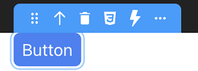

Components are the building blocks of your application. To add a component, drag it from the Components section and drop it on the canvas.

## Component list

The Component library lets you search for a component or choose one from the list. Once a component is on the canvas, you can [customize its look](styling.md) and bind a data source to it.

The following components are available: 

|Component|Description|
|---|---|
|Webform| Base container that holds all the other components| 
|Stylebox| Container used to keep the content centered and legible |
|Grid| Allows you to produce complex and responsive layouts faster. Grid areas can be edited directly on the canvas |
|Columns|Displays data inside columns|
|Tabs|Organizes and allows navigation between groups of content that are related and at the same level of hierarchy|
|Text input|Allows users to enter data in a form|
|Button|Triggers actions on a web page|
|Radio button|Allows selecting one of a set of options (only one option can be selected at any time)|
|Range input|Allows selecting a value in a range|
|Select box|Allows selecting an item in a list|
|Image|Displays an image|
|Icon|Displays an icon|
|Checkbox|Allows the user to make a binary choice (boolean value)|
|Text|Displays text on a web page|
|Datatable|Displays data in the form of a table. You can select a row to interact with the server|
|Matrix| Container of repeated style boxes|
|Webform loader| Allows you to embed a Webform inside another

> More components will be available in the future, and the existing components will be enhanced.

## Server-side reference

The server-side reference of a component is its "address" on the server. To set the behavior of a component, you can give it a server-side reference, and then [use that reference in class functions](../API/WebFormItemClass.md).

To assign a server-side reference to a component, enter a value in the Properties panel > Server Side:

## Managing your components

You can use the following tools to manage your components.

### Tooltip

When you select a component, the tooltip displays its type and offers several actions:

|Icon|Action|
|---|---|
|Cursor|Move the selected component on the canvas|
|Arrow|Select the parent component|
|Delete|Remove the selected component from the canvas|
|CSS|Export the [overriden CSS properties](styling.md#overriding-style-properties) to a new CSS class|
|Barred T|Reset styles (resets the [overriden CSS properties](styling.md#overriding-style-properties))|
|Duplicate icon|Duplicate the component|

The tooltip is contextual. This means that some actions are only available to certain elements, and not others. For example, you can duplicate a Text input component, but not its individual parts (Label and Input).

### Breadcrumbs

When you select a component, the breadcrumbs display its hierarchy:

To select any parent component displayed in the breadcrumbs trail, click its name. 

### Outline

The outline section displays the hierarchy of your webform:

Click an element in the list to select it, or click and drag it anywhere in the outline to move it somewhere else.

To display or hide an element, click the eye icon.