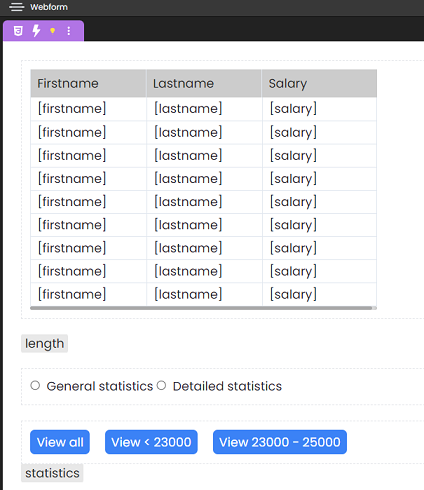
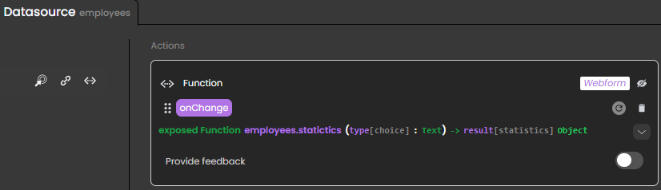
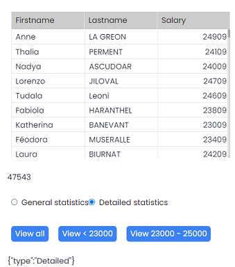

Aside from events triggered by end-user actions, events can trigger automatically when [datasources](../datasources.md) are updated.

For a list of datasource events, see [List of available events](#list-of-datasource-events).

## Example 

In the image below: 

* The **Datatable** component displays a list of employees, based on an entity selection (the `employees` datasource is attached).
* The button slices the `employees` entity selection datasource to keep only the first three entities.
* An `onChange` event is attached to the `employees` datasource. It triggers when the datasource is updated.
* The **Text** component contains a local datasource of type Text, called *result*.



When the end-user clicks the button, the `employees` datasource is updated, triggering the `onChange` event. This calls the `displayValue` function to update *result*:



The `displayValue` function returns text according to the number of entities: 

```4d 
exposed function displayValue() -> $result : Text
$result:="The table now displays " + String(This.length) + " entries"
```

Here's what you obtain after the button is clicked:



## List of datasource events 

### On Change

An On Change event attached a datasource triggers in the following cases:

|Trigger|Description|
|---|---|
|Datasource|<ul><li>The reference pointed by the datasource changes in the web browser (not on the server)</li><li>The entity is [touched](https://developer.4d.com/docs/en/API/EntityClass.html#touched)</li></ul>|
|Entity attribute|The contents of the entity attribute change.|
|Local datasource|The contents of the local datasource change.|
|Entity selection datasource| <li>The reference pointed by the datasource changes in the web browser (not on the server)</li>
<li>An entity is added to the entity selection</li>|