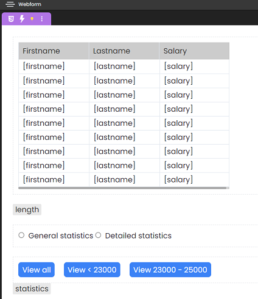
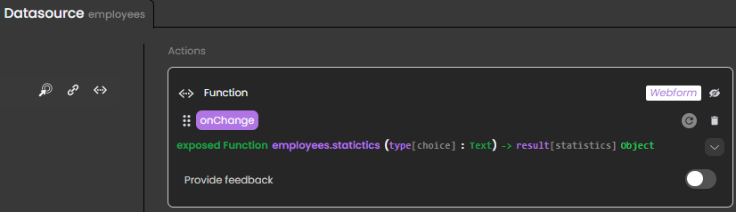
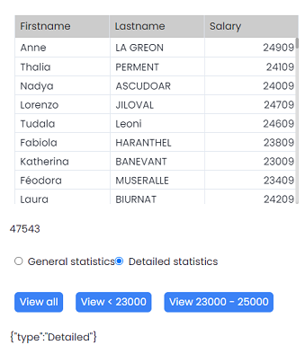

Events are usually used as a means of triggering certain behaviors. They are used in conjunction with different actions to create interactions in an application.

For example, if the user clicks a button on a webpage, you can choose how to react by calling a function or opening another webpage. Events can also be triggered [when a datasource is updated](#datasource-events). 

With 4D Web Studio, events are used to execute code on the 4D web server. No additional Javascript is needed.

## Configuring an event

You can bind your webform events to different actions such as executing a function or navigating to another webform.

### Bind a class function to an event

1. Select a component or a datasource. The configuration panel displays the events compatible with the element selected

2. Click a **"+"** button in the list to attach the corresponding event to the component or datasource. 

3. Select **execute a Member Function**

4. Add parameters (datasources or values) and point at a local or remote datasource to update:

    

    :::note Tip

    Passing values as parameters lets you test the behavior of a function without creating a datasource.

    :::

A class function can be mapped to several events, and you can assign several events to the same class function.

### Bind a navigation action to an event

To create navigation in your application, you can attach a navigation action to an event. That way, when the event triggers, it opens a webform in the current browser tab or in a new one.

1. Select a component or a datasource and attach an event to it
2. Select the navigation action to perform when the event triggers
3. Define if the webform opens in the current browser tab or a new one:


:::note

Webforms do not currently share their contexts. This means that datasources are currently not shared between webforms. For example, you cannot use webform1's datasources in webform2.  

:::
### Chaining actions

You can attach several events to a component or datasource. 

Events are executed in their defined order. When an event triggers, its actions are executed sequentially. This means that each action starts only when the previous one has finished executing.

## Event types

Events can be set to trigger when end-users perform certain actions or when datasources are updated.
### User events

You can set events to trigger when end-users perform certain actions, such as clicking a button.

#### Example: Search feature using the `onChange` event

The objective is to update a list of students displayed in a **Matrix** component according to what the end-user types in an input area.

In the image below: 
* The **Input** element is bound to the local datasource `search` (of type Text)
* The **Matrix** component displays a list of students based on the `students` datasource, which is an entity selection


To display results corresponding to the text typed in the **Input** component, we need a `search` function that performs a query:

```4d
exposed Function search($search : Text)->$result : cs.StudentsSelection
	
$search:="@"+$search+"@"
	
$result:=This.query("firstname = :1 or lastname = :1"; $search)   
```

An **onChange** event calls the `search` function and passes the text typed in the **Input** element as a parameter. This updates the `students` datasource:


Now everytime the text changes inside the **Input** element, a query is sent and the list of students displayed in the **Matrix** component is updated.

###  Datasource events

Aside from events triggered by end-user actions, events can trigger automatically when datasources are updated.

For a list of datasource events, see [List of available events](#list-of-available-events).

#### Example - Updating an entity selection

In the image below: 

* The **Datatable** component displays a list of employees, based on an entity selection (the `employees` datasource is attached).
* The button slices the `employees` entity selection datasource to keep only the first three entities.
* An `onChange` event is attached to the `employees` datasource.
* The **Text** component contains a local datasource of type Text, called *result*.



When the end-user clicks the button, the `employees` datasource is updated, triggering the `onChange` event. This calls `displayValue` to update *result*:



The `displayValue` function returns text according to the number of entities: 

```4d 
exposed function displayValue() -> $result : Text
$result:="The table now displays " + String(This.length) + " entries"
```

Here's what you obtain after the button is clicked:



### List of datasource events  

### On Change

An On Change event attached a datasource triggers in the following cases:

|Trigger|Description|
|---|---|
|Datasource|<ul><li>The reference pointed by the datasource changes in the web browser (not on the server)</li><li>The entity is [touched](https://developer.4d.com/docs/en/API/EntityClass.html#touched)</li></ul>|
|Entity attribute|The contents of the entity attribute change|
|Local datasource|The contents of the local datasource change|
|Entity selection datasource| <li>The reference pointed by the datasource changes in the web browser (not on the server)</li><li>An entity is added to the entity selection</li>|

:::note 

The On Error event is not available yet.

:::