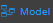

The structure of your project is called a [Model](model/model-editer.md). When you click on an
empty space in the Data Model Editor, you can view the properties for
your Model(coming soon). By default, a Model does not contain any
default datastore classes; you have to create the datastore classes
either in the Data Model Editor or through the **?**

You access your current project\'s model by double-clicking on
 in your project's sidebar menu.

***Note**: You can zoom out on your project's model to view the whole
structure of the datastore classes it contains; or zoom in to get a
clearer view of a specific datastore class.*

### Model editor interface

In Qodly, the structure of your Model is organized in a new way that
allows you to better manage your datastore classes, attributes,
functions and their properties.

You will find more in depth information in Model Editor - overview on
everything interface **from the toolbar to the Properties Area**

### Datastore Classes

### Datastore functions 

### Attributes

### Functions and Events 

> The Datastore class functions, datastore class events, attribute
> events, and calculated attribute events are structured in the
> following way.

### Model Properties - Coming soon..

\*\*maybe add a little part about Model Permissions here
eventually\*\*

##### 
