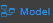

The structure of your project is called a Model. When you click on an empty space in the Data Model Editor, you can view the properties for your Model(coming soon). By default, a Model does not contain any default datastore classes; you can create datastore classes from the Data Model Editor.

You access your current project's model by double-clicking on   in your project's sidebar menu.

***Note**: You can zoom out on your project's model to view the whole structure of the datastore classes it contains; or zoom in to get a clearer view of a specific datastore class.*

### Model editor interface

In Qodly, the structure of your Model is organized in a new way that allows you to better manage your datastore classes, attributes, functions and their properties.

You will find more in depth information in Model Editor - overview on everything interface **from the toolbar to the Properties Area**

### Datastore Classes

A Datastore is an interface that allows us to reference a structure and access its data; Datastore Classes are object models within it that describe this data. Tables in the database provided by the datastore are handled through Datastore Classes. A dataclass is related to a single Datastore in which you can add custom functions. Each field of the table is an attribute of the dataclass.

### Attributes

An attribute is the smallest storage cell in our relational database, It’s used to designate dataclass properties that store data.

Relation attributes are used to conceptualize relations between dataclasses (many-to-one and one-to-many).

### Datastore functions 

Datastore functions allow us to execute code that can be applied to the Datastore Class in order to process data, manipulate data and create result sets.

##### 
